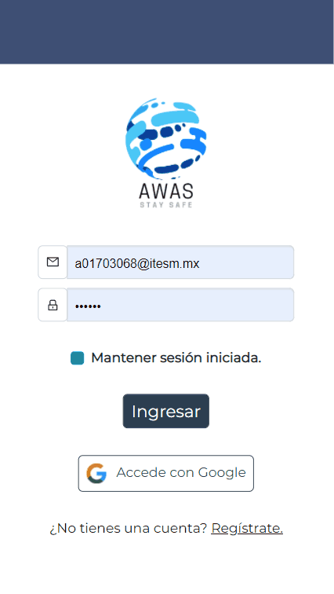
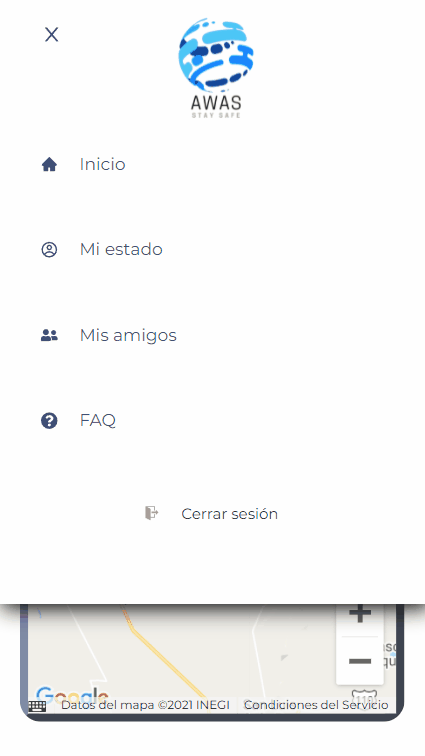
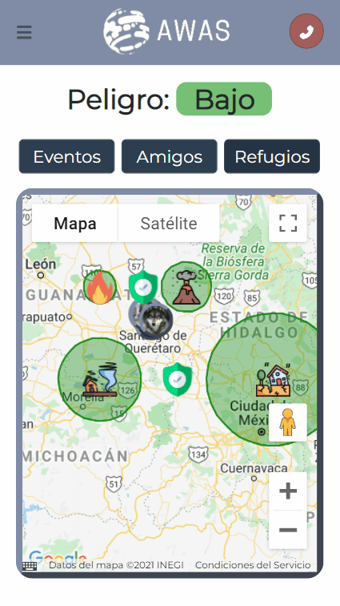
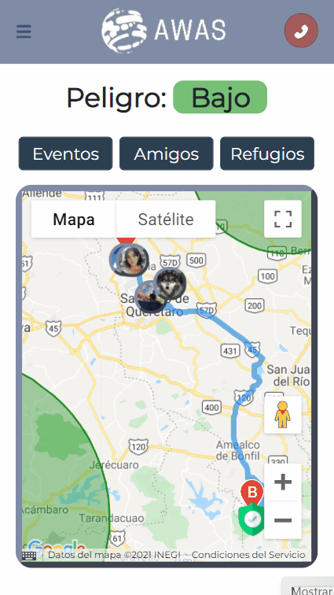
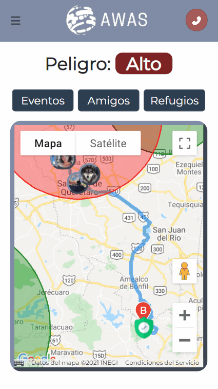
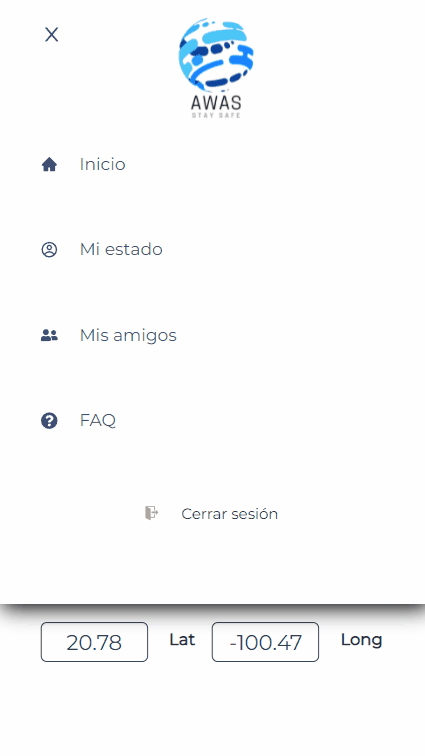

# Hackatec 2021

# Awas

## Advanced Weather Advice System

## Índice

1. [Autores](#Autores)
1. [Resumen](#Resumen)
   1. [Contexto](#Contexto)
   1. [Descripción](#Descipción)
1. [Especificaciones del producto](#Product-Spec)

## Autores

- Mónica Andrea Ayala Marrero 
- Esteban Padilla Cerdio 
- Fermín Méndez García 
- José Ángel Rico Mendieta 
- Juan Manuel González Ascencio 

## Resumen

### Contexto

Esta aplicación fue diseñada como proyecto para el Hackatec 2021 promocionado por Leadsales. El tema del evento fue "El fin del mundo", y los participantes debieron generar una solución para ayudar a la supervivencia de los usuarios durante algún evento apocalíptico.

### Descripción

Advanced Weather Advice System (AWAS) es una aplicación web móvil diseñada para advertir y asistir a los usuarios durante eventos de catástrofe, primariamente provocados por desastres naturales. Está diseñada para funcionar en un muy probable futuro donde los eventos catastróficos sean cosa del día a día, y se tenga que estar al pendiente en todo momento de la salud de uno mismo y de la de los seres queridos. La app le permite al usuario identificar la ubicación y radio de daño de eventos desastrosos a su al rededor, seguir la ubicación y estado de salud en tiempo real de sus amigos y seres queridos, y conseguir direcciones hacia los refugios más cercanos.

### Ubicación

Accede a AWAS desde tu celular <a href="http://awasapp.web.app">aquí</a>.

## Especificaciones del producto

### Funciones por pantalla

- Inicio de sesión

  - Con correo
  - Con Google

- Registro

  - Con correo
    - Nombre, teléfono, foto de perfil
  - Con Google

- Menú desplegable

  - Inicio
  - Mi estado
  - Mis amigos
  - FAQ
  - Cerrar sesión

- Botón de llamada directa a número de emergencia

- Inicio
  - Banner de estado de seguridad según la distancia del usuario relativa a desastres naturales
  - Mapa
    - Eventos
      - Ubicación
      - Radio de daño
      - Tipo de evento
        - Tsunami
        - Terremoto
        - Tornado
        - Volcán
        - Huracán
        - Incendio
    - Amigos
      - Ubicación
      - Foto de perfil
      - Estado de salud
      - Llamada directa
      - Indicaciones para llegar a su ubicación
    - Refugios
      - Ubicación
      - Dirección
      - Indicaciones para llegar a su ubicación
  - Seleccionar si se quiere mostrar o esconder cada uno de los tipos de dato anteriores
  - Mapa normal, de relieve, satelital, vista de calle

	
	
	

- Mi estado

  - Accede a y modifica tu estado de salud
  - Accede a y modifica tu ubicación
  - Accede a tu información personal

- Mis amigos
  - Enlista las personas que sigues
    - Foto de perfil
    - Nombre
    - Distancia relativa de ti
    - Estado de salud
  - Busca nuevos contactos
  - Sigue o deja de seguir a usuarios

- FAQ

  - Preguntas frecuentes en caso de emergencia

